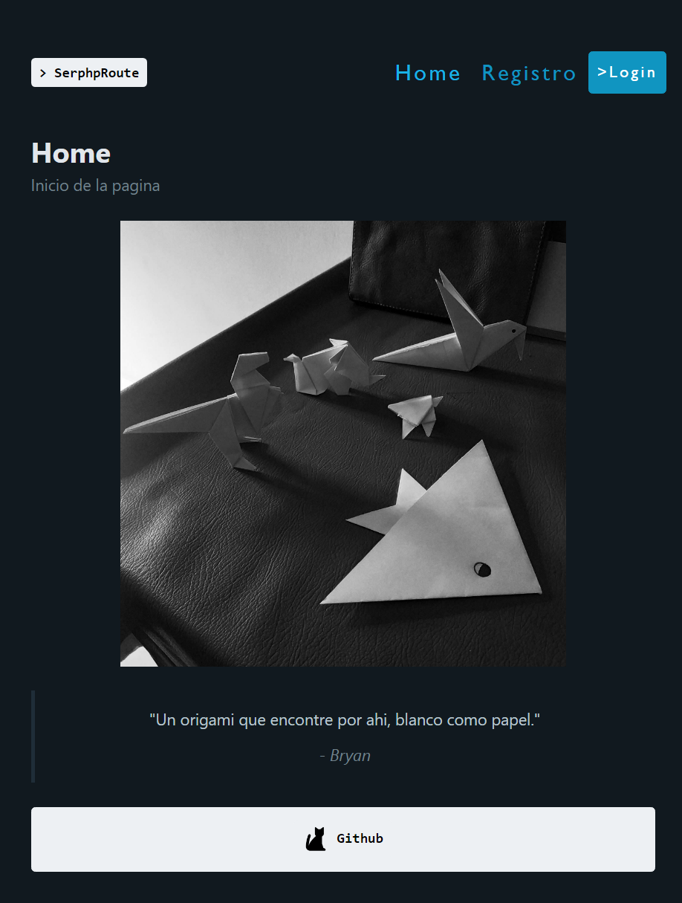

# SerphpRouter

```console
* cd 
* npm install react-router-dom@6.4 axios
* npm install
* npm run dev
```

## Use 

* `React`
* `Vite` 
* `Context` 
* `Pico CSS` 
* `Router v6.4`
* `Firebase`

## Preview web
 

[Serphp Route](https://exquisite-speculoos-e07e7a.netlify.app)
